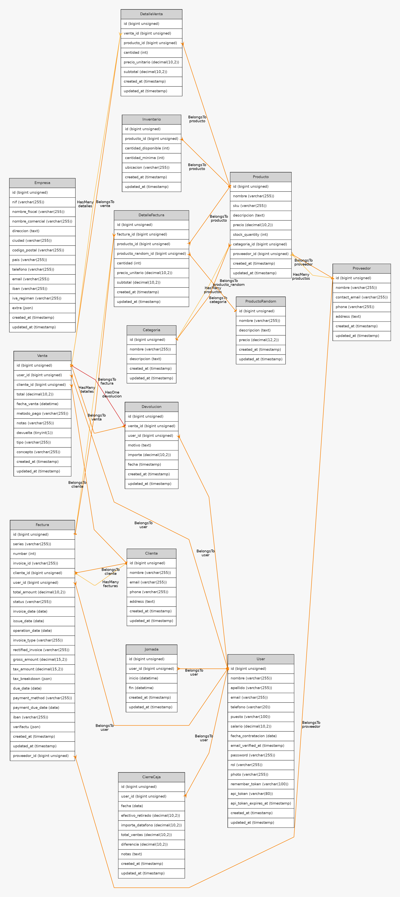

# J-J ERP — Sistema de Gestión Empresarial

Sistema ERP (_Enterprise Resource Planning_) full-stack desarrollado como proyecto intermodular de DAW. Centraliza la gestión de un negocio: punto de venta, facturación electrónica, inventario, control horario de empleados, estadísticas y panel de administración.

### Acceso en producción

| Interfaz                    | URL pública                                           |
| --------------------------- | ----------------------------------------------------- |
| Frontend Angular SPA        | https://j-j-proyect.duckdns.org                       |
| Panel Admin Blade           | https://j-j-proyect.duckdns.org/admin                 |
| API REST (base)             | https://j-j-proyect.duckdns.org/api                   |

---

## Índice

1. [Descripción general](#1-descripción-general)
2. [Objetivos y evidencia de cumplimiento](#2-objetivos-y-evidencia-de-cumplimiento)
3. [Arquitectura del sistema](#3-arquitectura-del-sistema)
4. [Stack tecnológico](#4-stack-tecnológico)
5. [Módulos funcionales](#5-módulos-funcionales)
6. [Base de datos](#6-base-de-datos)
7. [Seguridad](#7-seguridad)
8. [CI/CD y despliegue en AWS](#8-cicd-y-despliegue-en-aws)
9. [Puesta en marcha local](#9-puesta-en-marcha-local)
10. [Documentación de la API](#10-documentación-de-la-api)
11. [Estado de requisitos por módulo](#11-estado-de-requisitos-por-módulo)
12. [Equipo y planificación](#12-equipo-y-planificación)
13. [Mejoras futuras](#13-mejoras-futuras)

---

## 1. Descripción general

J-J ERP es una aplicación web modular orientada a pequeños y medianos negocios. Permite a los **administradores** gestionar todos los recursos de la empresa desde un panel centralizado (Blade), y a los **empleados** (vendedores y gerentes) operar desde una SPA Angular moderna con acceso a:

- Punto de venta con cobro y devoluciones
- Facturación con numeración secuencial y envío a Verifactu
- Gestión de stock e inventario en tiempo real
- Control de jornada laboral (fichaje entrada/salida)
- Estadísticas de ventas y cierre de caja
- Gestión de su propio perfil

El sistema está completamente **desplegado en AWS** sobre infraestructura definida como código con Terraform y con un pipeline CI/CD totalmente automatizado vía GitHub Actions.

---

## 2. Objetivos y evidencia de cumplimiento

### 2.1 API REST sólida con Laravel

**Objetivo:** Proveer un backend unificado que gestione la lógica de negocio y la persistencia de todos los módulos del ERP.

**Dónde se cumple:**

- `backend/routes/api.php` — más de 60 endpoints REST organizados en grupos por recurso, todos protegidos con `Route::middleware('auth:sanctum')` salvo el login. Rutas nombradas explícitamente con `->name()` / `->names()`.
- `backend/app/Http/Controllers/Api/` — 19 controladores (AuthController, ProductoController, FacturaController, VentaController, JornadaController, CierreCajaController, DevolucionController, EstadisticasController, y más).
- `backend/app/Models/` — 14 modelos Eloquent con relaciones definidas.
- `backend/database/migrations/` — 31 migraciones que construyen el esquema completo de forma reproducible.
- `backend/database/seeders/` — 11 seeders con datos realistas de prueba (usuarios, productos, proveedores, clientes, ventas, facturas e inventario).

**Por qué:** Laravel 12 ofrece un ecosistema maduro con migraciones, Eloquent ORM, Sanctum para autenticación por token y una arquitectura MVC que facilita el mantenimiento. El uso de `apiResource` reduce código repetitivo y garantiza convención sobre configuración para las rutas CRUD estándar.

---

### 2.2 Autenticación y autorización

**Objetivo:** Controlar el acceso a la API y al panel admin con roles diferenciados.

**Dónde se cumple:**

- `backend/app/Models/User.php` — trait `HasApiTokens` de Sanctum.
- `backend/app/Http/Controllers/Api/AuthController.php` — método `login()` valida credenciales y emite token Bearer con TTL de 12 horas (`createToken('api-token', ['*'], now()->addHours(12))`); `logout()` revoca el token actual.
- `backend/routes/api.php` — todas las rutas están bajo `middleware('auth:sanctum')` salvo `POST /api/login`.
- `backend/routes/web.php` — el panel `/admin` usa guard `web` con sesiones (patrón Breeze).
- `frontend/src/app/auth/auth.guard.ts` — `AuthGuard` redirige a `/login` si no hay token.
- `frontend/src/app/auth/admin.guard.ts` — `AdminGuard` bloquea `/usuarios` a roles no-admin.
- Tres roles definidos: `admin`, `gerente`, `vendedor`.

**Por qué:** Sanctum es la solución oficial de Laravel para SPAs y APIs. Los tokens con expiración evitan sesiones indefinidas; el guard de Angular impide que el usuario acceda a rutas restringidas sin consultar al servidor.

---

### 2.3 Facturación electrónica con numeración atómica

**Objetivo:** Generar facturas con número correlativo único y soporte para envío al sistema Verifactu.

**Dónde se cumple:**

- `backend/app/Http/Controllers/Api/FacturaController.php` — asignación atómica de número de factura mediante `invoice_counters` + `lockForUpdate()` (bloqueo de fila), garantizando que dos facturas creadas simultáneamente nunca reciban el mismo número.
- `backend/routes/api.php` — ruta `GET /api/facturas/next-number` declarada **antes** del `apiResource` para evitar que `next-number` sea interpretado como `{factura}`.
- `backend/app/Services/VerifactuService.php` — servicio encapsulado con método `send()` para el envío al servicio externo de facturación.
- `POST /api/facturas/{id}/resend-verifactu` — permite reintentar el envío de una factura sin duplicarla.
- `backend/database/migrations/2026_03_24_000100_create_invoice_counters_table.php` — tabla dedicada al contador de facturas.

**Por qué:** El bloqueo optimista con `lockForUpdate` en la tabla `invoice_counters` es la única forma correcta de garantizar unicidad sin condiciones de carrera en un entorno con múltiples requests concurrentes. Encapsular la comunicación con Verifactu en un Service aísla el código de integración del controlador.

---

### 2.4 SPA Angular moderna con componentes reutilizables

**Objetivo:** Ofrecer una interfaz SPA con Angular 20 para la interacción de usuarios y vendedores.

**Dónde se cumple:**

- `frontend/src/app/app.routes.ts` — routing con Standalone Components y lazy loading; rutas hijas bajo `AuthenticatedLayout` con guards.
- `frontend/src/app/services/api.service.ts` — capa de servicio centralizada con más de 45 métodos HTTP; gestión de errores centralizada en `handleError()` con `catchError`.
- `frontend/src/app/auth/auth.service.ts` — persistencia del token en `localStorage` (`api_token`, `current_user`).
- `frontend/src/app/paginador/paginador.ts` — componente reutilizable con `@Input() paginaActual`, `@Input() totalPaginas`, `@Input() etiqueta` y `@Output() paginaCambiada`; usado en `UsuariosComponent` y otros listados.
- Módulos: `dashboard`, `pos`, `billing`, `stock`, `time-control`, `usuarios`, `perfil`, `settings`, `help`.

**Por qué:** Angular 20 con Standalone Components elimina la necesidad de NgModules, reduciendo el boilerplate. El patrón de service centralizado facilita el mantenimiento al tener un único punto de gestión de errores y cabeceras HTTP.

---

### 2.5 Panel de administración Blade

**Objetivo:** Panel web completo para la gestión interna con autenticación por sesión.

**Dónde se cumple:**

- `backend/routes/web.php` — prefijo `/admin` con rutas de login, dashboard y CRUDs.
- `backend/app/Http/Controllers/` — controladores Blade para usuarios, productos, empleados, clientes y configuración de empresa.
- `backend/resources/views/` — vistas Blade con Bootstrap 5 y Bootstrap Icons.
- `backend/app/Http/Middleware/RedirectIfNotAuthenticated.php` — redirige a `admin.login` si no hay sesión activa.

**Por qué:** El panel admin requiere operaciones sensibles (gestión de usuarios, roles, configuración) que son más apropiadas bajo un flujo de sesión web que bajo API token. Blade permite renderizado en servidor con protección CSRF nativa de Laravel.

---

### 2.6 Infraestructura como código con Terraform

**Objetivo:** Desplegar la infraestructura completa en AWS de forma reproducible y automatizada.

**Dónde se cumple:**

- `despliegue/main.tf` — define las 4 instancias EC2 (Bastion, Frontend, API, Database), 2 EIPs (Bastion y Frontend), VPC, Security Groups y zona DNS privada en Route53.
- `despliegue/variable.tf` — variables parametrizadas (región, dominio, zona interna).
- `despliegue/outputs.tf` — exporta IPs de las instancias para su uso en GitHub Secrets.
- `despliegue/templates/` — `user_data` scripts por instancia para bootstrap automático (instalación de PHP, Apache, MySQL, Node, ModSecurity).
- `.github/workflows/full-deploy.yml` — workflow que ejecuta `terraform destroy + apply` completo con actualización automática de Secrets en GitHub.

**Por qué:** Terraform permite recrear toda la infraestructura desde cero en minutos, garantizando entornos reproducibles. La separación en 4 instancias aísla responsabilidades: el Bastion actúa como único punto de entrada SSH, sin exponer la red interna.

---

### 2.7 Pipeline CI/CD completo con GitHub Actions

**Objetivo:** Automatizar el ciclo de tests, build y despliegue en cada push a `main`.

**Dónde se cumple:**

- `.github/workflows/tests.yml` — ejecuta PHPUnit (backend) y `ng test --watch=false --browsers=ChromeHeadlessCI` (frontend) en cada push y PR.
- `.github/workflows/ci-cd-deploy.yml` — 4 jobs: `test-backend` → `deploy-backend` y `build-frontend` → `deploy-frontend`. Transferencia con rsync. Solo despliega en `main`.
- `.github/workflows/full-deploy.yml` — despliegue completo con Terraform (destruye y recrea infraestructura) más despliegue de la app. Activación manual.
- `.github/workflows/setup-https.yml` — configura Certbot + plugin DuckDNS para obtener certificado Let's Encrypt. Activación manual post-infraestructura.

**Por qué:** La separación en 4 workflows permite ejecutar solo lo necesario según el contexto (tests en PRs, deploy solo en main, HTTPS una vez tras provisionar). Los jobs de test y build del frontend corren en paralelo para reducir el tiempo total del pipeline.

---

### 2.8 Tests automatizados

**Objetivo:** Verificar el correcto funcionamiento del sistema de forma automatizada.

**Dónde se cumple:**

- `backend/tests/Feature/` y `backend/tests/Unit/` — tests PHPUnit del backend.
- `frontend/src/app/auth/auth.service.spec.ts` — tests del servicio de autenticación.
- `frontend/src/app/services/api.service.spec.ts` — tests del servicio API.
- `frontend/src/app/paginador/paginador.spec.ts` — tests del componente paginador.
- `.github/workflows/tests.yml` — ejecución automática en CI con 27 tests Angular y suite PHPUnit.

---

### 2.9 HTTPS y seguridad

**Objetivo:** Garantizar comunicaciones cifradas y aplicar capas de seguridad en todos los niveles.

**Dónde se cumple:**

- `.github/workflows/setup-https.yml` — instala certbot con plugin `certbot-dns-duckdns`, obtiene certificado Let's Encrypt para `j-j-proyect.duckdns.org` y configura Apache con SSL.
- `despliegue/templates/frontend.sh.tftpl` — instala `libapache2-mod-security2` (ModSecurity WAF) en modo detección.
- Cabeceras de seguridad en el VirtualHost HTTPS: `Strict-Transport-Security`, `X-Content-Type-Options`, `X-Frame-Options`, `Referrer-Policy`.
- Toda la API requiere token Bearer en la cabecera `Authorization: Bearer <token>`; los tokens de cabecera son inmunes a ataques CSRF por diseño (el navegador nunca los envía automáticamente). El middleware `EnsureFrontendRequestsAreStateful` de Sanctum ha sido eliminado del grupo middleware API en `bootstrap/app.php`, eliminando cualquier dependencia de cookies de sesión o dominios estáticos en las rutas API.
- El panel `/admin` (Blade) sigue protegido con sesión web + token CSRF nativo de Laravel, sin afección alguna por el cambio anterior.
- El servicio `AuthService` de Angular usa `finalize()` (en lugar de `tap`) en el método `logout()` para garantizar que el `localStorage` se limpia incluso si la petición de logout falla por error de red.
- El tráfico entre frontend y API pasa por Apache Proxy con `X-Forwarded-Proto: https` y `ProxyPreserveHost On`.
- Variables sensibles (APP_KEY, DB_PASSWORD, SSH_PRIVATE_KEY) gestionadas exclusivamente como GitHub Secrets, nunca en el repositorio.

---

## 3. Arquitectura del sistema

```
Internet (HTTPS)
       │
       ▼
┌──────────────────────────────────────────────────────┐
│                  AWS us-east-1                       │
│                                                      │
│  ┌──────────┐  EIP   ┌─────────────────────────────┐ │
│  │  BASTION │───────▶│     VPC — Red Privada        │ │
│  │ (SSH JH) │        │  jj.internal (Route53)       │ │
│  └──────────┘        │                              │ │
│       EIP            │  ┌────────────┐              │ │
│  j-j-proyect ──────▶ │  │  FRONTEND  │              │ │
│  .duckdns.org        │  │  Apache    │              │ │
│                      │  │  Angular   │              │ │
│                      │  │  +SSL      │              │ │
│                      │  └─────┬──────┘              │ │
│                      │        │ ProxyPass /api       │ │
│                      │        │ ProxyPass /admin     │ │
│                      │        ▼                      │ │
│                      │  ┌────────────┐              │ │
│                      │  │    API     │              │ │
│                      │  │  Apache    │              │ │
│                      │  │  Laravel   │              │ │
│                      │  │  PHP 8.3   │              │ │
│                      │  └─────┬──────┘              │ │
│                      │        │ MySQL TCP 3306       │ │
│                      │        ▼                      │ │
│                      │  ┌────────────┐              │ │
│                      │  │  DATABASE  │              │ │
│                      │  │  MySQL 8.0 │              │ │
│                      │  └────────────┘              │ │
│                      └─────────────────────────────┘ │
└──────────────────────────────────────────────────────┘
```

**Flujo de una petición API desde la SPA:**

1. El navegador hace `POST https://j-j-proyect.duckdns.org/api/login`
2. Apache en el Frontend recibe la petición por HTTPS (443), inyecta `X-Forwarded-Proto: https` y la proxifica hacia `http://api.jj.internal/api/login`
3. Apache en la API recibe la petición y la delega a PHP-FPM → Laravel
4. Laravel valida, emite token Sanctum y responde JSON
5. La respuesta regresa por el mismo proxy al navegador

---

## 4. Stack tecnológico

| Capa          | Tecnología              | Versión      | Justificación                                             |
| ------------- | ----------------------- | ------------ | --------------------------------------------------------- |
| Frontend SPA  | Angular (Standalone)    | 20.3         | Framework maduro, tipado fuerte, CLI, testing integrado   |
| Panel Admin   | Blade + Bootstrap 5     | —            | Renderizado servidor, CSRF nativo, sin complejidad SPA    |
| Backend       | Laravel                 | 12 (PHP 8.3) | Ecosistema completo: Eloquent, Sanctum, migraciones, jobs |
| Base de datos | MySQL                   | 8.0          | Relacional, ACID, amplio soporte en AWS                   |
| Auth API      | Laravel Sanctum         | 4.0          | Tokens Bearer ligeros, ideal para SPA + API móvil         |
| Servidor web  | Apache 2                | —            | Módulos ProxyPass, SSL, ModSecurity                       |
| WAF           | ModSecurity             | 2            | Capa de detección de ataques web                          |
| HTTPS         | Let's Encrypt + Certbot | —            | Certificados gratuitos, renovación automática             |
| DNS público   | DuckDNS                 | —            | DNS dinámico gratuito para dominio estable                |
| DNS interno   | AWS Route53             | zona privada | Resolución interna entre instancias EC2                   |
| IaC           | Terraform               | 1.5.7        | Infraestructura reproducible como código                  |
| CI/CD         | GitHub Actions          | —            | Integrado con el repositorio, sin infraestructura extra   |
| Entorno local | Docker Compose          | —            | Reproducibilidad total del entorno de desarrollo          |

---

## 5. Módulos funcionales

### Backend — Controladores API

| Controlador                | Ruta base                   | Función                                          |
| -------------------------- | --------------------------- | ------------------------------------------------ |
| `AuthController`           | `/api/login`, `/api/logout` | Autenticación con Sanctum                        |
| `ProductoController`       | `/api/productos`            | CRUD de productos con categoría y proveedor      |
| `ProveedorController`      | `/api/proveedores`          | CRUD de proveedores                              |
| `ClienteController`        | `/api/clientes`             | CRUD de clientes                                 |
| `FacturaController`        | `/api/facturas`             | Facturación con número secuencial y Verifactu    |
| `DetalleFacturaController` | `/api/detalle-facturas`     | Líneas de factura                                |
| `VentaController`          | `/api/ventas`               | Ventas, pagos a proveedor, listado del día       |
| `DetalleVentaController`   | `/api/detalle-ventas`       | Líneas de venta                                  |
| `CategoriaController`      | `/api/categorias`           | CRUD de categorías                               |
| `InventarioController`     | `/api/inventarios`          | Control de stock por producto                    |
| `JornadaController`        | `/api/jornadas`             | Fichaje entrada/salida, resumen diario y mensual |
| `CierreCajaController`     | `/api/cierre-cajas`         | Registro y consulta de cierres de caja           |
| `DevolucionController`     | `/api/devoluciones`         | Registro de devoluciones de ventas               |
| `EmpleadoController`       | `/api/empleados`            | CRUD de empleados                                |
| `UserController`           | `/api/usuarios`             | Gestión de usuarios (solo admin)                 |
| `PerfilController`         | `/api/perfil`               | Consulta y edición del perfil propio             |
| `EmpresaController`        | `/api/empresa`              | Datos de la empresa emisora                      |
| `EstadisticasController`   | `/api/estadisticas`         | Estadísticas agregadas (admin/gerente)           |
| `AyudaController`          | `/api/ayuda`                | Envío de solicitudes de soporte                  |

### Frontend — Módulos Angular

| Módulo       | Ruta            | Acceso    | Función                                                          |
| ------------ | --------------- | --------- | ---------------------------------------------------------------- |
| Login        | `/login`        | Público   | Autenticación con email/contraseña                               |
| Dashboard    | `/dashboard`    | Todos     | Resumen de actividad: ventas del día, stock bajo, jornada activa |
| POS          | `/pos`          | Vendedor+ | Punto de venta: añadir productos, cobrar, gestionar devoluciones |
| Billing      | `/billing`      | Vendedor+ | Crear y consultar facturas; reintentar envío Verifactu           |
| Stock        | `/stock`        | Vendedor+ | Listado de productos con stock, alertas de mínimos               |
| Time Control | `/time-control` | Todos     | Fichar entrada/salida; ver resumen de jornada                    |
| Usuarios     | `/usuarios`     | Admin     | CRUD de usuarios y asignación de roles                           |
| Perfil       | `/perfil`       | Todos     | Editar datos personales y foto                                   |
| Settings     | `/settings`     | Admin     | Configuración de la empresa emisora                              |
| Help         | `/help`         | Todos     | Formulario de solicitud de ayuda                                 |

---

## 6. Base de datos

La base de datos MySQL 8.0 contiene **15 tablas** construidas con 31 migraciones de Laravel. El esquema completo está documentado en [`docs/er-diagram.md`](docs/er-diagram.md).

### Diagrama Entidad-Relación



### Relaciones principales

| Tabla       | Relaciones clave                                                                           |
| ----------- | ------------------------------------------------------------------------------------------ |
| `users`     | → jornadas, ventas, facturas, cierre_cajas, devoluciones                                   |
| `productos` | → categorias (N:1), proveedores (N:1), inventarios (1:1), detalle_ventas, detalle_facturas |
| `ventas`    | → users, clientes, detalle_ventas, devoluciones                                            |
| `facturas`  | → clientes, users, proveedores, detalle_facturas, invoice_counters                         |
| `empleados` | unificados con `users` (migración `merge_empleados_into_users`)                            |

### Seeders disponibles

`UserSeeder`, `CategoriaSeeder`, `ProductoSeeder`, `ProveedorSeeder`, `ClienteSeeder`, `InventarioSeeder`, `EmpleadoSeeder`, `EmpresaSeeder`, `VentaSeeder`, `FacturaSeeder` y `DatabaseSeeder` (orquestador).

---

## 7. Seguridad

| Capa           | Medida                       | Implementación                                                                              |
| -------------- | ---------------------------- | ------------------------------------------------------------------------------------------- |
| Transporte     | HTTPS obligatorio            | Certbot + Let's Encrypt; redirect 301 HTTP→HTTPS en Apache                                  |
| Cabeceras      | Headers de seguridad         | `HSTS`, `X-Content-Type-Options`, `X-Frame-Options`, `Referrer-Policy` en VirtualHost HTTPS |
| WAF            | ModSecurity                  | `libapache2-mod-security2` en modo detección; `SecRuleEngine DetectionOnly`                 |
| API Angular    | Bearer Token (CSRF-immune)   | Sanctum con TTL 12 h; cabecera `Authorization: Bearer`; CSRF no aplica a cabeceras HTTP     |
| Sesiones Admin | CSRF + sesión web            | Guard `web` de Laravel con token CSRF en formularios Blade; `EnsureFrontendRequestsAreStateful` aplica solo a rutas web, no a `/api/*` |
| Roles          | Autorización a nivel de ruta | `AdminGuard` (Angular), comprobaciones de rol en controladores                              |
| Credenciales   | GitHub Secrets               | `APP_KEY`, `DB_PASSWORD`, `SSH_PRIVATE_KEY` nunca en el repositorio                         |
| Red            | Bastion + VPC privada        | La API y la BD no tienen IP pública; solo accesibles a través del Bastion                   |
| Facturación    | Numeración atómica           | `lockForUpdate()` en `invoice_counters` evita números duplicados en concurrencia            |

---

## 8. CI/CD y despliegue en AWS

### Workflows

| Workflow        | Fichero            | Activación                   | Función                                            |
| --------------- | ------------------ | ---------------------------- | -------------------------------------------------- |
| Tests           | `tests.yml`        | Push/PR a `main` y `develop` | PHPUnit + `ng test` en ChromeHeadless              |
| Deploy continuo | `ci-cd-deploy.yml` | Push a `main`                | Tests → Build frontend → Deploy backend + frontend |
| Deploy completo | `full-deploy.yml`  | Manual                       | Terraform destroy+apply + deploy completo          |
| HTTPS           | `setup-https.yml`  | Manual                       | Certbot + DuckDNS DNS challenge                    |

### Pipeline de deploy continuo

```
push a main
   │
   ├─[paralelo]─ test-backend (PHPUnit)          ─┐
   │                                              ├─▶ deploy-backend (rsync → EC2 API)
   │             [si tests OK]                   ─┘     composer install --no-dev
   │                                                     php artisan migrate --force
   │                                                     config:cache · route:cache
   │                                                     restart php8.3-fpm + apache2
   │
   └─[paralelo]─ build-frontend (ng build prod)  ─┐
                  artefacto dist/                 ├─▶ deploy-frontend (rsync → EC2 Frontend)
                  [retención 1 día]              ─┘     cp dist/* /var/www/frontend
                                                        restart apache2
```

### GitHub Secrets requeridos

| Secret                  | Descripción                                                                       |
| ----------------------- | --------------------------------------------------------------------------------- |
| `SSH_PRIVATE_KEY`       | Clave privada PEM de AWS Academy (vockey)                                         |
| `BASTION_HOST`          | IP elástica (EIP) del Bastion — no cambia entre sesiones de laboratorio           |
| `API_HOST`              | IP privada del servidor API — se actualiza en cada sesión de laboratorio          |
| `FRONTEND_HOST`         | IP privada del servidor Frontend (usada en el túnel SSH a través del Bastion)     |
| `DB_HOST`               | IP privada de la base de datos                                                    |
| `APP_KEY`               | Clave de cifrado Laravel (`base64:...`)                                           |
| `DB_PASSWORD`           | Contraseña del usuario MySQL `laravel_user`                                       |
| `DUCKDNS_TOKEN`         | Token de la cuenta DuckDNS para actualizar DNS y obtener certificados             |
| `GH_PAT`                | Personal Access Token de GitHub (para actualizar Secrets desde `full-deploy.yml`) |
| `AWS_ACCESS_KEY_ID`     | Credencial AWS Academy — solo requerida en `full-deploy.yml` (Terraform)          |
| `AWS_SECRET_ACCESS_KEY` | Credencial AWS Academy — solo requerida en `full-deploy.yml` (Terraform)          |
| `AWS_SESSION_TOKEN`     | Token de sesión AWS Academy — se regenera en cada laboratorio                     |

> **Nota:** `SESSION_DOMAIN` se escribe directamente en el `.env` de producción por el propio workflow; no es un Secret de GitHub.

---

## 9. Puesta en marcha local

### Requisitos

- [Docker Desktop](https://www.docker.com/products/docker-desktop/)
- Git

### Arranque

```bash
# Clonar el repositorio
git clone https://github.com/jesusriosmlg/J-J-PROYECTO-INTERMODULAR.git
cd J-J-PROYECTO-INTERMODULAR

# Levantar todos los servicios (backend, frontend, MySQL, phpMyAdmin)
docker compose up --build -d
```

El contenedor de backend ejecuta automáticamente `composer install`, migraciones y todos los seeders.

### URLs disponibles

| Servicio                    | URL                            |
| --------------------------- | ------------------------------ |
| Frontend Angular SPA        | http://localhost               |
| API REST Laravel            | http://localhost:8000/api      |
| Panel Admin Blade           | http://localhost:8000/admin    |
| Documentación API (Swagger) | http://localhost:8000/swagger/ |
| phpMyAdmin                  | http://localhost:8080          |

### Credenciales de desarrollo (seeders)

| Rol      | Email                  | Contraseña |
| -------- | ---------------------- | ---------- |
| Admin    | admin@negocio.test     | password   |
| Gerente  | gerente@negocio.test   | password   |
| Vendedor | vendedor1@negocio.test | password   |

### Sin Docker (opcional)

```bash
# Backend
cd backend
composer install
cp .env.example .env
php artisan key:generate
php artisan migrate --seed
php artisan serve --host=0.0.0.0 --port=8000

# Frontend (en otra terminal)
cd frontend
npm ci
npm run start
```

---

## 10. Documentación de la API

La documentación interactiva de la API está disponible en local en **http://localhost:8000/swagger/** mediante una interfaz Swagger UI estática.

- Especificación OpenAPI 3.0.3: `backend/public/swagger/openapi.yaml`
- Cubre los 19 módulos de la API con ejemplos de request/response
- Incluye el esquema de autenticación Bearer (Sanctum)
- Solo disponible en entorno local; no expuesta en producción

Para probar endpoints desde Swagger UI:

1. Hacer `POST /api/login` con credenciales de desarrollo
2. Copiar el token de la respuesta
3. Pulsar **Authorize** e introducir el token en el campo Bearer

---

## 11. Estado de requisitos por módulo

> `✅` Cumplido · `⚠️` Parcial o pendiente

### DIW — Diseño de Interfaces Web

| Estado | Requisito                                                                                                           |
| ------ | ------------------------------------------------------------------------------------------------------------------- |
| ✅ OBL | Paleta corporativa coherente (`#0a2342`, `#17375e`, semáforo verde/naranja/rojo), jerarquía tipográfica y contraste |
| ✅ OBL | CSS con alcance por componente, nomenclatura semántica, Flexbox, CSS Grid y media queries responsivas               |
| ✅ OBL | Transiciones e interacciones hover/focus en todos los botones e inputs                                              |
| ✅ OBL | Framework de estilos: Bootstrap 5 + Bootstrap Icons en Angular y en panel Blade                                     |
| ⚠️ OPC | Guía de estilos formal — paleta coherente en código, sin documento Figma                                            |

### DAW — Despliegue de Aplicaciones Web

| Estado | Requisito                                                                 |
| ------ | ------------------------------------------------------------------------- |
| ✅ OBL | Despliegue en AWS sin Elastic Beanstalk ni servicios simplificados        |
| ✅ OBL | 4 instancias EC2: Bastion, Frontend, API, Database — `despliegue/main.tf` |
| ✅ OBL | Infraestructura definida en Terraform                                     |
| ✅ OBL | Pipeline CI/CD con GitHub Actions (4 workflows)                           |
| ✅ OBL | Apache 2 con PHP 8.3 + Laravel en EC2 API                                 |
| ✅ OBL | IP elástica (`aws_eip`) asignada a Bastion y Frontend                     |
| ✅ OBL | HTTPS con Certbot / Let's Encrypt                                         |
| ✅ OPC | Base de datos MySQL en EC2 dedicado                                       |
| ✅ OPC | WAF ModSecurity activo en modo detección                                  |
| ✅ OPC | DNS privado con AWS Route53 (zona `jj.internal`, 4 registros A)           |
| ⚠️ OPC | RDS — se usa EC2 con MySQL en lugar de RDS gestionado                     |
| ⚠️ OPC | Balanceador de carga ELB — no implementado                                |

### DWES — Desarrollo Web en Entorno Servidor

| Estado | Requisito                                                                      |
| ------ | ------------------------------------------------------------------------------ |
| ✅ OBL | Laravel 12 con PHP 8.3                                                         |
| ✅ OBL | Base de datos MySQL 8.0                                                        |
| ✅ OBL | Tres roles: `admin`, `gerente`, `vendedor`                                     |
| ✅ OBL | 31 migraciones + `personal_access_tokens`                                      |
| ✅ OBL | 11 Seeders para todos los modelos                                              |
| ✅ OBL | Rutas protegidas con `auth:sanctum`                                            |
| ✅ OBL | API REST con más de 60 endpoints                                               |
| ✅ OBL | Control de versiones con Git / GitHub                                          |
| ✅ OBL | Laravel Sanctum: `HasApiTokens`, `createToken()`, token TTL 12 h               |
| ✅ OBL | Panel de administración Blade en `/admin` con login, CRUD y gestión            |
| ✅ OBL | Swagger UI estático + spec OpenAPI 3.0.3 completa en `backend/public/swagger/` |
| ✅ OBL | Diagrama Entidad-Relación en `docs/er-diagram.md`                              |
| ✅ OBL | Rutas nombradas explícitamente con `->name()` / `->names()`                    |

### DAWEC — Desarrollo de Aplicaciones Web en Entorno Cliente

| Estado | Requisito                                                                  |
| ------ | -------------------------------------------------------------------------- |
| ✅ OBL | Proyecto con Angular CLI 20.3                                              |
| ✅ OBL | Routing con guards `AuthGuard` y `AdminGuard`                              |
| ✅ OBL | Token en `localStorage` (`api_token`, `current_user`)                      |
| ✅ OBL | Módulo de administración `/usuarios` con acceso restringido por rol        |
| ✅ OBL | Services: `AuthService` y `ApiService`                                     |
| ✅ OBL | Conexión con la API REST (45+ métodos en `ApiService`)                     |
| ✅ OBL | `@Input()` / `@Output()` en `PaginadorComponent`                           |
| ✅ OBL | `catchError` centralizado en `handleError()` de `ApiService`               |
| ✅ OBL | 3 archivos `.spec.ts` con 27 tests unitarios                               |
| ✅ OBL | Tests ejecutados en GitHub Actions (`ng test --browsers=ChromeHeadlessCI`) |
| ✅ OBL | Control de versiones con Git / GitHub                                      |
| ✅ OBL | Tablero Trello con gestión de sprints — requiere acceso externo al tablero |

### IPE2 — Plan de Empresa

| Estado | Requisito                                                            |
| ------ | -------------------------------------------------------------------- |
| ⚠️ OBL | Marca, slogan y propuesta de valor — pendiente de documento formal   |
| ⚠️ OBL | Trámites jurídicos y plan de empresa — pendiente de documento formal |

### Inglés — Presentación

| Estado | Requisito                                                               |
| ------ | ----------------------------------------------------------------------- |
| ✅ OBL | Introducción y conclusión en inglés — preparada para la exposición oral |

---

## 12. Equipo y planificación

| Nombre        | Rol principal                                                              |
| ------------- | -------------------------------------------------------------------------- |
| Jesús Ríos    | Frontend Angular (SPA, guards, services, tests), despliegue AWS / Terraform |
| Jaime Gavilán | Frontend Angular, Backend Laravel (API REST, modelos, seeders, migraciones) |

**Metodología:** SPRINTs semanales gestionados con Trello. Seis sprints:

| Hito     | Contenido                                                         |
| -------- | ----------------------------------------------------------------- |
| Sprint 1 | Estructura del proyecto, migraciones y seeders                    |
| Sprint 2 | CRUDs principales: productos, proveedores, facturas, ventas       |
| Sprint 3 | Interfaz Angular, guards, services y conexión API                 |
| Sprint 4 | Módulos avanzados: jornada, cierre de caja, devoluciones, estadísticas |
| Sprint 5 | Tests automatizados, Swagger UI y documentación                   |
| Sprint 6 | Despliegue con Terraform, pipeline CI/CD y hardening de seguridad |

---

## 13. Mejoras futuras

| Prioridad | Mejora                                                                                      |
| --------- | ------------------------------------------------------------------------------------------- |
| Alta      | Restringir reglas de Security Groups en Terraform (SSH desde IP específica, no `0.0.0.0/0`) |
| Alta      | Añadir análisis estático en CI: PHPStan (backend) y ESLint (frontend)                       |
| Alta      | Ampliar cobertura de tests con pruebas de integración para los endpoints críticos           |
| Media     | Separar Dockerfiles para entornos `dev` y `prod`                                            |
| Media     | Escáner de secretos en pre-commit (gitleaks)                                                |
| Media     | Añadir E2E con Playwright para flujos principales (login, venta, factura)                   |
| Baja      | Migrar MySQL EC2 a RDS para aprovechar backups automáticos y réplicas gestionadas           |
| Baja      | Implementar balanceador de carga (ELB) para alta disponibilidad del frontend                |
